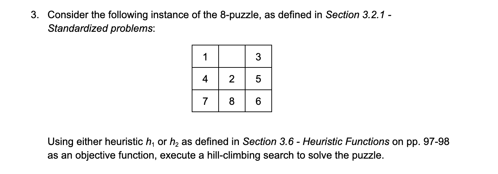

# A.I. 8-Puzzle Solver

Welcome to the AI 8-Puzzle Solver repository. This project is a Python implementation of an 8-puzzle solver that uses the hill-climbing search algorithm with the Manhattan distance heuristic. The 8-puzzle is a classic problem in artificial intelligence, and this solver demonstrates how to find a solution by iteratively optimizing the state using the chosen heuristic.

## About

The AI 8-Puzzle Solver is a Python-based project that aims to solve the classic 8-puzzle problem using artificial intelligence techniques. The 8-puzzle is a sliding puzzle with 8 tiles, initially arranged in random order, and a blank space. The objective is to rearrange the tiles into a predefined goal configuration by sliding them one at a time into the blank space. The AI 8-Puzzle Solver uses the hill-climbing search algorithm with the Manhattan distance heuristic to find a solution.



### Key Features:

- **Hill Climbing Algorithm:** The solver employs a hill-climbing search strategy to iteratively improve the puzzle's state based on a chosen heuristic.
- **Manhattan Distance Heuristic:** The Manhattan distance is used as a heuristic to estimate the number of moves required to reach the goal state. This heuristic helps guide the search.
- **Customization:** The project is designed to be customizable. You can extend it by implementing additional search algorithms, allowing users to specify initial and goal states, or enhancing the user interface.

The AI 8-Puzzle Solver is a valuable resource for both educational purposes and as a starting point for exploring AI-based problem-solving in Python. We encourage contributions and welcome ideas to improve and expand this project.

## Heuristics and Hill Climbing Search

### Heuristics in Problem Solving

In the field of artificial intelligence, heuristics are essential tools for guiding search algorithms when exploring solution spaces. A heuristic is a rule of thumb or an estimate that helps determine the quality of a potential solution without the need for an exhaustive search. Heuristics are particularly valuable in scenarios where finding an optimal solution is computationally expensive or impractical.

#### Manhattan Distance Heuristic

In the context of the AI 8-Puzzle Solver, the chosen heuristic is the Manhattan distance. The Manhattan distance heuristic estimates the number of moves required to transform the current state of the puzzle into the goal state. It calculates this distance by summing the absolute horizontal and vertical distances of each tile from its current position to its goal position. By using the Manhattan distance as a heuristic, the solver can assess the quality of each puzzle state and make informed decisions on which

## Hill Climbing Search

Hill climbing is a local search algorithm that falls under the category of optimization techniques. It is a straightforward yet effective approach for solving problems with many possible states. Hill climbing starts with an initial state and iteratively explores neighboring states to find the one that optimizes a given objective function. The search continues as long as improvements can be made to the objective function. When no better state can be found, the algorithm terminates.

In the context of the AI 8-Puzzle Solver, the objective function is based on the Manhattan distance heuristic. The solver begins with the initial state of the puzzle and systematically evaluates possible moves by calculating the Manhattan distance for each successor state. The move that minimizes the heuristic value is chosen, and the process continues until the goal state is reached or no better move can be found. Hill climbing is a simple yet effective strategy for solving the 8-puzzle problem and many other optimization problems.

The AI 8-Puzzle Solver showcases how heuristics and hill climbing search can work together to find solutions in a systematic and efficient manner. By understanding these concepts, users and contributors can gain insights into the underlying principles of this project and apply them to other problem-solving scenarios.

## Getting Started

To use this solver, you'll need Python installed on your system. Follow these steps to get started:

1. Clone this repository to your local machine:

```bash
git clone https://github.com/your-username/AI-8-Puzzle-Solver.git
```

1. Navigate to the repository directory:

```bash
cd AI-8-Puzzle-Solver
```

3. Run the solver:

```bash
python3 8puzzle.py
```

The solver will attempt to find a solution to the 8-puzzle problem using the hill-climbing algorithm with the Manhattan distance heuristic.

## Repository Structure

* `8puzzle.py`: The Python script containing the hill-climbing search implementation.
* `README.md`: This file providing information about the repository.
* Other files: You can include additional files and documentation as needed for your project.

## Customization

You can customize this solver and adapt it to your specific requirements. Here are some ways to extend the project:

* Implement additional search algorithms.
* Allow users to provide their own initial and goal states.
* Improve the user interface for input and output.

## Contributing

We welcome contributions to this project. If you'd like to contribute, please fork the repository, make your changes, and submit a pull request. Contributions that enhance the solver's functionality, improve code quality, or provide additional features are highly appreciated.

## License

This project is licensed under the MIT License. See the [LICENSE](https://chat.openai.com/c/LICENSE) file for details.

## Documentation

[https://docs.google.com/document/d/1i8ZF_3nv9Xu9OFSWNbx9NwFIbYK9zd9zeYxNLqdNRB0/edit?usp=sharing](https://docs.google.com/document/d/1i8ZF_3nv9Xu9OFSWNbx9NwFIbYK9zd9zeYxNLqdNRB0/edit?usp=sharing]())

## Contact

If you have any questions or need further assistance, please feel free to contact us at [[abelxmendoza@gmail.com](mailto:your.email@example.com)].

Happy puzzle-solving!
